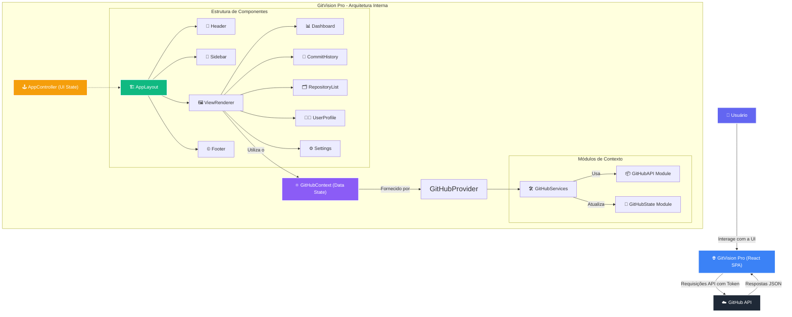

# GitVision Pro: Plataforma Avançada de Análise e Visualização de Dados do GitHub

*Sua bússola para navegar na complexidade do universo Git, transformando dados brutos em insights estratégicos e acionáveis.*

---

### Abstract (Resumo Técnico)

GitVision Pro é uma plataforma de análise de software como serviço (SaaS), implementada como uma Single-Page Application (SPA) em React, projetada para fornecer a desenvolvedores, equipes e gerentes de projeto uma visão profunda e multifacetada de suas atividades no GitHub. O projeto aborda a lacuna existente entre os dados brutos fornecidos pela API do GitHub e a necessidade de métricas consolidadas, análises históricas e insights de performance que não são nativamente oferecidos pela interface padrão. A solução proposta materializa-se em um dashboard interativo e altamente modular que consome diretamente a API do GitHub, operando inteiramente no lado do cliente para garantir a privacidade e segurança dos dados do usuário, com o token de acesso pessoal armazenado exclusivamente no `localStorage` do navegador. A metodologia arquitetônica é centrada em uma estrutura de componentes reativos com gerenciamento de estado desacoplado via React Context, otimizado para escalabilidade e manutenibilidade. As principais contribuições do projeto incluem um módulo de análise de histórico de commits sem precedentes, com filtragem temporal avançada e múltiplas visualizações (lista, timeline, analytics), um dashboard de performance com métricas agregadas e comparativas, e um perfil de desenvolvedor gamificado que quantifica e visualiza o impacto e a evolução técnica do usuário. GitVision Pro representa um avanço na instrumentação de engenharia de software, capacitando os usuários a tomar decisões informadas baseadas em dados empíricos sobre seus processos de desenvolvimento.

---

### Badges Abrangentes


---

### Sumário (Table of Contents)

1.  [Introdução e Motivação](#-introdução-e-motivação)
2.  [🔗 Acesso ao Projeto](#-acesso-ao-projeto)
3.  [Arquitetura do Sistema](#-arquitetura-do-sistema)
4.  [Decisões de Design Chave](#-decisões-de-design-chave)
5.  [✨ Funcionalidades Detalhadas](#-funcionalidades-detalhadas-com-casos-de-uso)
6.  [🛠️ Tech Stack Detalhado](#️-tech-stack-detalhado)
7.  [📂 Estrutura Detalhada do Código-Fonte](#-estrutura-detalhada-do-código-fonte)
8.  [📋 Pré-requisitos Avançados](#-pré-requisitos-avançados)
9.  [🚀 Guia de Instalação e Configuração](#-guia-de-instalação-e-configuração-avançada)
10. [⚙️ Uso Avançado e Exemplos](#️-uso-avançado-e-exemplos)
11. [🔧 API Reference](#-api-reference-se-aplicável)
12. [🧪 Estratégia de Testes e Qualidade de Código](#-estratégia-de-testes-e-qualidade-de-código)
13. [🚢 Deployment Detalhado e Escalabilidade](#-deployment-detalhado-e-escalabilidade)
14. [📜 Licença e Aspectos Legais](#-licença-e-aspectos-legais)
15. [👥 Equipe Principal e Colaboradores Chave](#-equipe-principal-e-colaboradores-chave)
16. [❓ FAQ (Perguntas Frequentes)](#-faq-perguntas-frequentes)
17. [📞 Contato e Suporte](#-contato-e-suporte)

---

### 📖 Introdução e Motivação

No ecossistema de desenvolvimento de software moderno, o GitHub transcendeu sua função original de um mero sistema de controle de versão para se tornar o epicentro da colaboração, do portfólio profissional e da dinâmica de projetos de código aberto e privados. No entanto, a interface nativa do GitHub, embora funcional para operações diárias, oferece uma visão superficial das métricas e tendências históricas que são cruciais para a melhoria contínua dos processos de engenharia de software. Desenvolvedores individuais carecem de ferramentas para visualizar seu crescimento e impacto, enquanto equipes e gestores lutam para extrair insights quantitativos sobre a saúde do projeto, a produtividade e a alocação de esforços.

Soluções existentes frequentemente são fragmentadas, caras ou exigem integrações complexas com plataformas de terceiros, criando barreiras de adoção e silos de dados. A motivação central para o GitVision Pro nasce dessa necessidade premente por uma ferramenta unificada, acessível e poderosa que democratize a análise de dados do GitHub. O projeto visa capacitar os usuários com uma plataforma que não apenas agrega estatísticas, mas também as contextualiza através de visualizações ricas e interativas.

A proposta de valor única do GitVision Pro reside em três pilares:
1.  **Profundidade Analítica:** Ir além das métricas de vaidade, oferecendo uma análise granular do histórico de commits, tendências de contribuição e métricas de performance do repositório.
2.  **Privacidade e Simplicidade:** Ao operar inteiramente no cliente, eliminamos a necessidade de um backend intermediário, garantindo que os dados sensíveis (como tokens de acesso) nunca saiam do navegador do usuário, simplificando drasticamente a arquitetura e o deploy.
3.  **Experiência do Usuário (UX):** Fornecer uma interface intuitiva, rápida e esteticamente agradável que transforma a exploração de dados em uma experiência engajadora e reveladora.

O objetivo de longo prazo é estabelecer o GitVision Pro como uma ferramenta indispensável no arsenal de qualquer desenvolvedor ou equipe que leve a sério a engenharia de software baseada em dados, promovendo uma cultura de transparência, autoavaliação e melhoria contínua.

---

### 🔗 Acesso ao Projeto

Acesse a versão de produção da plataforma, totalmente funcional e interativa, hospedada na Vercel. Experimente todas as funcionalidades de análise em tempo real conectando sua conta do GitHub.

<p align="center">
  <a href="https://project-zero-seven.vercel.app" target="_blank" rel="noopener noreferrer" style="text-decoration: none;">
    
  </a>
</p>

---

### 🏛️ Arquitetura do Sistema

GitVision Pro é projetado como uma Single-Page Application (SPA) com uma arquitetura client-side robusta, priorizando a interatividade, a segurança e a manutenibilidade. O sistema opera sem um backend proprietário, comunicando-se diretamente com a API do GitHub.



**Explicação dos Componentes Arquiteturais:**

1.  **Usuário (Actor):** O ponto de partida. O usuário interage com a aplicação através do navegador.
2.  **GitVision Pro (React SPA):** O núcleo da aplicação. É uma SPA construída com React e Vite que renderiza toda a interface do usuário e orquestra a lógica de negócios no cliente.
3.  **GitHub API (External Service):** A única fonte de dados externa. Todas as informações sobre repositórios, commits e usuários são buscadas diretamente desta API.
4.  **Arquitetura Interna:**
    *   **`GitHubProvider`:** O componente de mais alto nível que envolve a aplicação, disponibilizando o `GitHubContext`.
    *   **`GitHubContext`:** O coração do gerenciamento de estado de dados. Ele expõe o estado atual (repositórios, commits, etc.), estados de carregamento, erros e as funções para buscar e manipular esses dados.
    *   **Módulos de Contexto:**
        *   **`GitHubAPI Module`:** Uma classe encapsulada responsável por fazer as chamadas `fetch` para a API do GitHub. Abstrai a lógica de autenticação, headers e tratamento de erros de rede.
        *   **`GitHubState Module`:** Um hook customizado (`useGitHubState`) que gerencia todas as variáveis de estado (`useState`) relacionadas aos dados do GitHub, centralizando a lógica de estado.
        *   **`GitHubServices`:** Uma classe de serviço que atua como um orquestrador. Utiliza o `GitHubAPI` para buscar dados e o `GitHubState` para atualizar o estado da aplicação de forma consistente.
    *   **`AppController`:** Um hook customizado de alto nível que gerencia o estado da UI global, como a visão atual (Dashboard, Commits, etc.), modo escuro, estado da barra lateral e notificações. Ele é separado do `GitHubContext` para uma melhor separação de interesses (estado da UI vs. estado de dados).
    *   **Estrutura de Componentes:** A UI é decomposta em componentes lógicos e reutilizáveis, seguindo as melhores práticas do React. O `ViewRenderer` atua como um roteador dinâmico, renderizando a visão principal com base no estado do `AppController`.

---

### 💡 Decisões de Design Chave

*   **Arquitetura 100% Client-Side:** A decisão de não ter um backend próprio foi estratégica para simplificar o deploy, reduzir custos de manutenção e, mais importante, maximizar a privacidade do usuário. O token de acesso do GitHub, uma credencial sensível, é armazenado no `localStorage` do navegador e nunca é transmitido para um servidor de terceiros, mitigando vetores de ataque. O trade-off é a dependência direta do cliente em relação à disponibilidade e aos limites de taxa da API do GitHub.
*   **Gerenciamento de Estado com React Context e Hooks Customizados:** Para uma aplicação de complexidade moderada como esta, o uso da API de Contexto nativa do React, combinada com hooks customizados (`useGitHub`, `useAppController`), oferece uma solução de gerenciamento de estado leve e poderosa. Evitou-se a complexidade adicional de bibliotecas como Redux, enquanto a modularização do contexto em `API`, `State` e `Services` previne o problema de "prop-drilling" e mantém o código organizado e testável.
*   **TypeScript de Ponta a Ponta:** A adoção do TypeScript foi fundamental. Em uma aplicação tão intensiva em dados, com tipos complexos vindos da API do GitHub, o TypeScript garante a segurança de tipos, melhora o autocompletar do editor (IntelliSense) e reduz drasticamente a probabilidade de bugs em tempo de execução, tornando o código mais robusto e fácil de refatorar.
*   **Vite como Ferramenta de Build:** A escolha do Vite em vez do Create React App (CRA) foi motivada pela sua performance superior no ambiente de desenvolvimento, com Hot Module Replacement (HMR) quase instantâneo, e builds de produção otimizados que utilizam módulos ES nativos.
*   **Tailwind CSS para UI:** A abordagem utility-first do Tailwind CSS permitiu um desenvolvimento de UI rápido e consistente. Em vez de escrever CSS customizado, as classes utilitárias são compostas diretamente no JSX, o que acelera a prototipagem e garante a aderência a um sistema de design coeso.
*   **Modularização por Funcionalidade (Feature-based):** A estrutura de diretórios, especialmente dentro de `src/components`, é organizada por funcionalidades (ex: `Dashboard`, `CommitHistory`). Isso melhora a localidade do código; todos os arquivos relacionados a uma feature (componentes, hooks, tipos específicos) estão juntos, facilitando a navegação e a manutenção.

---

### ✨ Funcionalidades Detalhadas (com Casos de Uso)

GitVision Pro oferece um conjunto coeso de ferramentas para análise profunda do GitHub:

*   **Dashboard Avançado**
    *   **Descrição:** Uma visão panorâmica e agregada de toda a sua atividade no GitHub. Apresenta cartões de estatísticas chave (total de repositórios, stars, forks, commits, etc.) e gráficos interativos.
    *   **Caso de Uso:** Um gerente de engenharia quer avaliar a performance da equipe no último trimestre. Ele utiliza o filtro de tempo "3M" no dashboard para visualizar o número total de commits, a criação de novos repositórios e a distribuição de linguagens de programação mais utilizadas no período, identificando tendências e alocando recursos de forma mais eficaz.

*   **Análise de Repositórios**
    *   **Descrição:** Uma lista completa de todos os seus repositórios, com opções avançadas de busca, filtragem (por visibilidade, status de arquivamento, linguagem) e ordenação (por data de atualização, estrelas, tamanho, etc.).
    *   **Caso de Uso:** Um desenvolvedor precisa encontrar rapidamente todos os seus repositórios privados escritos em TypeScript que foram atualizados no último mês para realizar uma auditoria de segurança. Ele utiliza os filtros de "privado", "TypeScript" e o filtro de data para isolar instantaneamente a lista de repositórios relevantes.

*   **Histórico de Commits Detalhado**
    *   **Descrição:** A funcionalidade central do GitVision Pro. Permite uma exploração sem precedentes do histórico de commits de um único repositório ou de todos os repositórios simultaneamente. Inclui filtros avançados por autor, busca de texto e um seletor de intervalo de tempo extremamente granular.
    *   **Visualizações:**
        *   **Lista:** Apresenta commits em cartões ricos em informações (`CommitCard`), mostrando autor, mensagem, estatísticas de linhas alteradas e tipo de commit (feat, fix, etc.).
        *   **Timeline:** Mostra os commits em uma linha do tempo vertical e cronológica, ideal para entender a sequência de eventos.
        *   **Analytics:** Uma página dedicada com gráficos sobre a atividade de commits ao longo do tempo, distribuição por hora do dia, estatísticas por autor e muito mais.
    *   **Caso de Uso:** Durante uma revisão de código, um líder técnico quer entender a evolução de uma feature específica. Ele seleciona o repositório, busca pela issue relacionada na mensagem dos commits e visualiza a timeline de todos os commits associados, analisando o impacto de cada mudança e o trabalho do contribuidor.

*   **Perfil de Desenvolvedor Gamificado**
    *   **Descrição:** Transforma seu perfil do GitHub em um dashboard de performance pessoal. Exibe estatísticas avançadas, gráficos de contribuição por linguagem, e um sistema de conquistas (`Achievements`) que reconhece marcos importantes (ex: "Colecionador de Stars", "Poliglota").
    *   **Caso de Uso:** Um desenvolvedor júnior utiliza seu perfil no GitVision Pro para acompanhar seu progresso. Ele define a meta de desbloquear a conquista "Poliglota" e começa a contribuir para projetos em novas linguagens, visualizando seu gráfico de contribuições mudar ao longo do tempo.

*   **Configurações e Gerenciamento de Dados**
    *   **Descrição:** Uma área centralizada para gerenciar a aplicação. Permite ao usuário atualizar ou revogar seu token do GitHub, alternar o tema (claro/escuro), configurar notificações, exportar/importar as configurações da aplicação e limpar o cache local.
    *   **Caso de Uso:** Um usuário está migrando para um novo computador. Ele utiliza a função "Exportar Configurações" para salvar suas preferências e, no novo dispositivo, utiliza "Importar Configurações" para restaurar instantaneamente seu ambiente de trabalho no GitVision Pro.

---

### 🛠️ Tech Stack Detalhado

| Categoria | Tecnologia | Versão (do `package.json`) | Propósito no Projeto | Justificativa da Escolha |
| :--- | :--- | :--- | :--- | :--- |
| **Framework Frontend** | React | `^19.1.0` | Construção da interface de usuário reativa e base da SPA. | Padrão de mercado, ecossistema robusto, modelo de componentes ideal para UIs complexas. A versão 19 introduz melhorias de performance. |
| **Linguagem** | TypeScript | `~5.8.3` | Superset do JavaScript que adiciona tipagem estática. | Essencial para a robustez e manutenibilidade de uma aplicação que lida com estruturas de dados complexas da API do GitHub. |
| **Build Tool** | Vite | `^7.0.4` | Ferramenta de build e servidor de desenvolvimento. | Performance superior em desenvolvimento (HMR rápido) e builds otimizados para produção. |
| **Styling** | Tailwind CSS | `^3.4.1` | Framework de CSS utility-first. | Agiliza o desenvolvimento da UI, garante consistência visual e facilita a criação de um sistema de design responsivo. |
| **Styling Engine** | PostCSS | `^8.4.35` | Ferramenta para transformar CSS com plugins. | Utilizado pelo Tailwind para processar e otimizar as classes utilitárias. |
| **State Management**| React Context API | N/A (Nativo) | Gerenciamento de estado global e compartilhado. | Solução nativa do React, suficiente para a complexidade do projeto, evitando a sobrecarga de bibliotecas externas. |
| **Charting** | Recharts | `^2.12.7` | Biblioteca de gráficos para React. | Oferece uma API declarativa e componentes compostos para criar gráficos interativos e customizáveis. |
| **Ícones** | Lucide React | `^0.525.0` | Biblioteca de ícones SVG. | Leve, consistente e com uma vasta coleção de ícones de alta qualidade, ideal para uma UI moderna. |
| **Linting** | ESLint | `^9.30.1` | Ferramenta de análise estática para encontrar problemas no código. | Garante a qualidade e a padronização do código, aplicando regras de estilo e prevenindo erros comuns. |

---

### 📂 Estrutura Detalhada do Código-Fonte

A estrutura do projeto foi desenhada para ser modular e escalável, com uma clara separação de responsabilidades.

```
project-zero-main/
├── .github/              # Configurações do GitHub (ex: FUNDING.yml).
├── public/               # Arquivos estáticos (ícones, etc.) servidos diretamente.
├── src/                  # Coração da aplicação, contém todo o código-fonte.
│   ├── assets/           # Ativos de imagem (SVGs) usados nos componentes.
│   ├── components/       # Componentes React reutilizáveis e de views.
│   │   ├── Dashboard/    # Componentes específicos da view Dashboard.
│   │   ├── CommitHistory/# Componentes da complexa view de Histórico de Commits.
│   │   │   └── hooks/    # Hooks customizados para a lógica de commits.
│   │   ├── AppController.tsx # Hook para gerenciar o estado global da UI.
│   │   ├── AppLayout.tsx # Componente de layout principal (Header, Sidebar, etc.).
│   │   ├── Settings.tsx  # Componente da view de Configurações.
│   │   └── ViewRenderer.tsx # Componente que renderiza a view ativa.
│   ├── context/          # Lógica de gerenciamento de estado e API.
│   │   ├── modules/      # Separação da lógica do contexto em módulos.
│   │   │   ├── GitHubAPI.ts      # Classe para chamadas diretas à API.
│   │   │   ├── GitHubServices.ts # Classe orquestradora de serviços.
│   │   │   └── GitHubState.ts    # Hook para gerenciar o estado dos dados.
│   │   └── GitHubContext.tsx # Provider e hook principal do contexto.
│   ├── types/            # Definições de tipos TypeScript globais.
│   │   ├── app.ts        # Tipos específicos da aplicação (views, menus).
│   │   └── github.ts     # Tipos que modelam a resposta da API do GitHub.
│   ├── App.tsx           # Componente raiz que monta a aplicação.
│   ├── main.tsx          # Ponto de entrada da aplicação, renderiza o App.
│   └── style.css         # Estilos globais e importações do Tailwind.
├── .gitignore            # Arquivos e pastas a serem ignorados pelo Git.
├── index.html            # Ponto de entrada HTML da SPA.
├── LICENSE               # Licença do projeto (MIT).
├── package.json          # Metadados do projeto e lista de dependências.
├── tailwind.config.js    # Arquivo de configuração do Tailwind CSS.
├── tsconfig.json         # Configuração principal do compilador TypeScript.
└── vite.config.ts        # Arquivo de configuração do Vite.
```

---

### 📋 Pré-requisitos Avançados

Para compilar e executar este projeto localmente, você precisará dos seguintes softwares e credenciais:

*   **Node.js:** Versão `v18.0.0` ou superior.
*   **npm (Node Package Manager):** Versão `9.0.0` ou superior (geralmente vem com o Node.js).
*   **Git:** Para clonar o repositório.
*   **GitHub Personal Access Token (Classic):** Uma credencial é necessária para que a aplicação possa fazer requisições autenticadas à API do GitHub em seu nome. Siga as instruções dentro da aplicação ou na [documentação do GitHub](https://docs.github.com/en/authentication/keeping-your-account-and-data-secure/managing-your-personal-access-tokens) para gerar um. Escopos necessários:
    *   `repo`: Acesso completo a repositórios (públicos e privados).
    *   `user`: Acesso a informações do seu perfil.
    *   `read:org`: Acesso de leitura a organizações das quais você faz parte.

---

### 🚀 Guia de Instalação e Configuração Avançada

Siga os passos abaixo para ter uma instância do GitVision Pro rodando em seu ambiente de desenvolvimento.

1.  **Clonar o Repositório:**
    Abra seu terminal e clone o projeto usando Git.

    ```bash
    git clone https://github.com/ESousa97/project-zero.git
    ```

2.  **Navegar para o Diretório do Projeto:**

    ```bash
    cd project-zero
    ```

3.  **Instalar as Dependências:**
    Use `npm` para instalar todas as dependências listadas no `package.json`.

    ```bash
    npm install
    ```

4.  **Iniciar o Servidor de Desenvolvimento:**
    Este comando iniciará o servidor de desenvolvimento do Vite, geralmente na porta `http://localhost:5173`.

    ```bash
    npm run dev
    ```

5.  **Configurar o Token de Acesso:**
    *   Ao abrir a aplicação no navegador pela primeira vez, um modal aparecerá solicitando seu GitHub Personal Access Token.
    *   Cole o token gerado (conforme os pré-requisitos) no campo apropriado.
    *   A aplicação armazenará o token de forma segura no `localStorage` do seu navegador para sessões futuras. Não há necessidade de configurar arquivos `.env`.

6.  **Scripts Adicionais:**
    *   `npm run build`: Compila e otimiza a aplicação para produção.
    *   `npm run lint`: Executa o ESLint para verificar a qualidade do código.
    *   `npm run preview`: Inicia um servidor local para visualizar a build de produção.

---

### ⚙️ Uso Avançado e Exemplos

*   **Análise Cross-Repositório:** Na página "Commits", use o seletor de repositórios e escolha a opção "Todos os repositórios". Isso acionará uma busca profunda em todos os seus repositórios, consolidando os commits em uma única interface para análise. É uma ferramenta poderosa para entender sua atividade de codificação geral.

*   **Atalhos de Teclado:** A aplicação possui atalhos para agilizar a navegação e as ações (identificados em `AppController.tsx`):
    *   `Ctrl/Cmd + 1`: Navegar para o Dashboard.
    *   `Ctrl/Cmd + 2`: Navegar para a lista de Repositórios.
    *   `Ctrl/Cmd + 3`: Navegar para o Histórico de Commits.
    *   `Ctrl/Cmd + 4`: Navegar para o Perfil.
    *   `Ctrl/Cmd + ,`: Abrir Configurações.
    *   `Ctrl/Cmd + R`: Atualizar todos os dados do GitHub.
    *   `Ctrl/Cmd + B`: Alternar a barra lateral (contrair/expandir).
    *   `Esc`: Fechar a janela de notificações se estiver aberta.

---

### 🔧 API Reference (se aplicável)

Este projeto é um **consumidor** da API do GitHub e **não expõe** uma API própria. Toda a interação com dados é feita através de chamadas diretas e autenticadas para os endpoints da API REST do GitHub (`https://api.github.com`). A lógica para essas chamadas está encapsulada no módulo `src/context/modules/GitHubAPI.ts`.

---

### 🧪 Estratégia de Testes e Qualidade de Código

Atualmente, o projeto não possui uma suíte de testes automatizados formal. A qualidade do código é mantida primariamente através do uso de TypeScript para segurança de tipos e ESLint para padronização de código e detecção de erros comuns.

Uma estratégia de testes robusta é um item prioritário no roadmap e contemplaria:

*   **Testes Unitários:** Utilizando **Vitest** e **React Testing Library** para testar hooks customizados (ex: `useCommitFilters`, `useDashboardData`) e componentes individuais de forma isolada, garantindo que a lógica interna funcione como esperado.
*   **Testes de Integração:** Testar a interação entre vários componentes, como a forma como os filtros no `CommitFilters` afetam a renderização do `CommitList`.
*   **Testes End-to-End (E2E):** Utilizando uma ferramenta como **Cypress** ou **Playwright** para simular fluxos de usuário completos, como "fazer login com token, navegar até a página de commits, aplicar um filtro e verificar se os resultados são atualizados corretamente".
*   **Mocking da API:** Utilizar **Mock Service Worker (MSW)** para interceptar as chamadas à API do GitHub durante os testes, permitindo simular respostas de sucesso, erro e casos extremos sem depender da API real.

---

### 🚢 Deployment Detalhado e Escalabilidade

O GitVision Pro está atualmente implantado na **Vercel**, uma plataforma otimizada para aplicações frontend modernas.

*   **Processo de CI/CD:** A Vercel está integrada diretamente ao repositório no GitHub. Qualquer push ou merge para a branch `main` aciona automaticamente um novo processo de build e deploy. A Vercel executa o comando `npm run build` e implanta os ativos estáticos resultantes em sua CDN global.
*   **Escalabilidade:** Como uma aplicação puramente client-side, a escalabilidade é inerentemente alta. A carga de computação é distribuída para os navegadores dos usuários, e os ativos estáticos são servidos por uma CDN global e resiliente. O principal gargalo de escalabilidade não está na infraestrutura de hospedagem, mas nos **limites de taxa da API do GitHub**. Usuários com um número muito grande de repositórios ou que realizam atualizações muito frequentes podem encontrar esses limites. Futuras otimizações podem incluir estratégias de cache mais agressivas no `localStorage` ou `IndexedDB` para mitigar esse problema.

---

### 📜 Licença e Aspectos Legais

Este projeto é distribuído sob a **Licença MIT**.

Isso significa que você tem a liberdade de usar, copiar, modificar, mesclar, publicar, distribuir, sublicenciar e/ou vender cópias do software, desde que o aviso de copyright e a permissão da licença sejam incluídos em todas as cópias ou partes substanciais do software.

Para mais detalhes, consulte o arquivo [LICENSE](/LICENSE) no repositório.

---

### 👥 Equipe Principal e Colaboradores Chave

*   **Autor Principal:** Enoque Sousa
    *   **GitHub:** [@ESousa97](https://github.com/ESousa97)
    *   **LinkedIn:** [Enoque Sousa](https://www.linkedin.com/in/enoque-sousa-bb89aa168/)

---

### ❓ FAQ (Perguntas Frequentes)

*   **P: Por que a aplicação solicita um token com escopo de `repo`?**
    *   **R:** O escopo `repo` é necessário para acessar seus repositórios privados e para buscar informações detalhadas sobre commits e contribuidores, que não estão disponíveis em repositórios públicos sem autenticação adequada. O GitVision Pro precisa desse acesso para fornecer uma análise completa e precisa.

*   **P: Meus dados e meu token estão seguros?**
    *   **R:** Sim. A segurança dos seus dados é uma prioridade máxima. O GitVision Pro opera 100% no seu navegador. Seu token do GitHub é armazenado exclusivamente no `localStorage` do seu navegador e **nunca** é enviado para nenhum servidor de terceiros. Toda a análise de dados ocorre localmente.

*   **P: Recebi um erro de "API rate limit exceeded". O que faço?**
    *   **R:** A API do GitHub impõe um limite de 5.000 requisições por hora para usuários autenticados. Se você tem muitos repositórios ou atualiza os dados com muita frequência, pode atingir esse limite. A melhor solução é aguardar uma hora para que o limite seja redefinido. Melhorias no sistema de cache estão no roadmap para mitigar esse problema no futuro.

---

### 📞 Contato e Suporte

Para relatar bugs, solicitar novas funcionalidades ou fazer perguntas sobre o projeto, o canal preferencial é a seção de **Issues** do repositório no GitHub.

*   **[Abrir uma nova Issue](https://github.com/ESousa97/project-zero/issues)**

---

> ✨ **Criado em:** 12 de jul. de 2025 às 16:15
