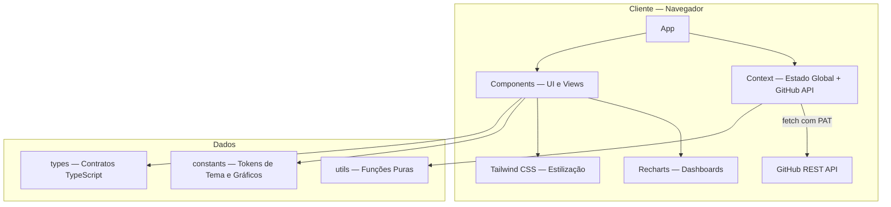

<div align="center">

# GitVision Pro

[](https://github.com/ESousa97/project-zero/actions/workflows/ci.yml)
[](https://www.codefactor.io/repository/github/esousa97/project-zero)
[](https://opensource.org/licenses/MIT)
[](#)

**Plataforma web para análise avançada de atividade em repositórios GitHub — SPA React 19 com TypeScript 5 e Vite 7, dashboards interativos via Recharts (commits, linguagens, produtividade, saúde de repositórios), integração com GitHub REST API (`/user`, `/user/repos`, `/repos/{owner}/{repo}/commits`, `/repos/{owner}/{repo}/languages`), estilização Tailwind CSS 3 com tokens de tema centralizados, persistência local de preferências e token PAT via localStorage, testes Vitest + Testing Library, lint ESLint + Prettier e deploy na Vercel.**

[Demo](https://project-zero-seven.vercel.app) · [Repositório](https://github.com/ESousa97/project-zero)

</div>

---

> **⚠️ Projeto Arquivado**
> Este projeto não recebe mais atualizações ou correções. O código permanece disponível como referência e pode ser utilizado livremente sob a licença MIT. Fique à vontade para fazer fork caso deseje continuar o desenvolvimento.

---

## Índice

- [Sobre o Projeto](#sobre-o-projeto)
- [Funcionalidades](#funcionalidades)
- [Tecnologias](#tecnologias)
- [Arquitetura](#arquitetura)
- [Estrutura do Projeto](#estrutura-do-projeto)
- [Começando](#começando)
  - [Pré-requisitos](#pré-requisitos)
  - [Instalação](#instalação)
  - [Uso](#uso)
- [Scripts Disponíveis](#scripts-disponíveis)
- [Endpoints Consumidos](#endpoints-consumidos)
- [FAQ](#faq)
- [Licença](#licença)
- [Contato](#contato)

---

## Sobre o Projeto

Plataforma web que consolida dados da API do GitHub em dashboards interativos para observabilidade de produtividade, atividade de commits, distribuição de linguagens e saúde de repositórios. A aplicação é uma SPA executada inteiramente no cliente, com persistência local de preferências e token de acesso.

O repositório prioriza:

- **Dashboards analíticos com Recharts** — Gráficos interativos para visualização de atividade de commits, distribuição de linguagens por repositório, métricas de produtividade e saúde de repos, com tokens de tema centralizados em `constants/` para consistência visual
- **Integração com GitHub REST API** — Consumo de 4 endpoints (`/user`, `/user/repos`, `/repos/{owner}/{repo}/commits`, `/repos/{owner}/{repo}/languages`) via context global, com base URL configurável por `VITE_GITHUB_API_BASE` e autenticação via Personal Access Token (PAT)
- **Estado global via Context API** — Integração com a API do GitHub gerenciada em `context/`, separando lógica de fetching/caching da apresentação em componentes
- **Persistência local segura** — Token PAT e preferências do usuário armazenados em `localStorage`, mantendo a aplicação stateless no servidor
- **Qualidade automatizada** — ESLint + Prettier para lint/formatação, Vitest + Testing Library para testes unitários, script `validate` que executa pipeline local completa (`lint` + `test` + `build`)
- **Deploy na Vercel** — Build de produção via Vite 7, CI com matriz de versões Node, Dependabot para dependências

---

## Funcionalidades

- **Dashboard de commits** — Visualização de atividade de commits por repositório com gráficos Recharts interativos
- **Distribuição de linguagens** — Análise de linguagens utilizadas por repositório via endpoint `/repos/{owner}/{repo}/languages`
- **Métricas de produtividade** — Indicadores consolidados de atividade e saúde dos repositórios do usuário
- **Filtros operacionais** — Filtros para segmentação de dados por repositório, período e critérios de atividade
- **Autenticação via PAT** — Configuração de Personal Access Token do GitHub com persistência local
- **Tema e preferências** — Tokens de estilo centralizados e preferências persistidas entre sessões via localStorage
- **Base URL configurável** — `VITE_GITHUB_API_BASE` permite apontar para instâncias GitHub Enterprise ou custom proxies

---

## Tecnologias


---

## Arquitetura



### Camadas

| Diretório | Responsabilidade |
| --- | --- |
| `components/` | Componentes de UI, views e dashboards |
| `context/` | Estado global, integração com GitHub API, caching |
| `constants/` | Tokens de tema, configurações de gráficos Recharts |
| `styles/` | Tokens CSS e estilos globais |
| `types/` | Contratos e interfaces TypeScript |
| `utils/` | Funções utilitárias puras |
| `test/` | Setup de testes (Vitest + Testing Library) |

---

## Estrutura do Projeto

```
project-zero/
├── src/
│   ├── components/                 # Componentes de UI e views (dashboards, filtros, autenticação)
│   ├── context/                    # Estado global + integração GitHub API
│   ├── constants/                  # Tokens de tema e configurações de gráficos
│   ├── styles/                     # Estilos globais e tokens CSS
│   ├── types/                      # Interfaces e tipos TypeScript
│   ├── utils/                      # Funções utilitárias puras
│   └── test/                       # Setup de testes
├── docs/
│   ├── architecture.md             # Documentação de arquitetura
│   └── setup.md                    # Setup e configuração
├── .github/
│   └── workflows/
│       └── ci.yml                  # CI com matriz de versões Node
├── .env.example                    # VITE_GITHUB_API_BASE
├── package.json
├── tsconfig.json
├── vite.config.ts
├── tailwind.config.ts
├── eslint.config.js
├── CONTRIBUTING.md
├── LICENSE                         # MIT
└── README.md
```

---

## Começando

### Pré-requisitos

```bash
node -v   # >= 20.0.0
npm -v    # >= 10
```

Um [Personal Access Token (PAT)](https://github.com/settings/tokens) do GitHub com permissões de leitura de repositórios.

### Instalação

```bash
git clone https://github.com/ESousa97/project-zero.git
cd project-zero
npm install
cp .env.example .env
```

### Uso

```bash
npm run dev
```

Acesse `http://localhost:5173`. Insira seu GitHub PAT na interface para autenticação.

**Produção:** [project-zero-seven.vercel.app](https://project-zero-seven.vercel.app)

---

## Scripts Disponíveis

```bash
# Desenvolvimento
npm run dev                 # Dev server (Vite)

# Build
npm run build               # Build de produção
npm run preview             # Serve build localmente

# Qualidade
npm run lint                # ESLint
npm run lint:fix            # ESLint com auto-fix
npm run format              # Prettier — formatar
npm run format:check        # Prettier — validar

# Testes
npm run test                # Vitest
npm run test:watch          # Vitest em modo watch
npm run test:coverage       # Vitest com cobertura

# Pipeline local
npm run validate            # lint + test + build
```

---

## Endpoints Consumidos

Integração com GitHub REST API (client-side):

| Método | Endpoint | Descrição |
| --- | --- | --- |
| `GET` | `/user` | Dados do usuário autenticado |
| `GET` | `/user/repos` | Lista de repositórios do usuário |
| `GET` | `/repos/{owner}/{repo}/commits` | Histórico de commits por repositório |
| `GET` | `/repos/{owner}/{repo}/languages` | Distribuição de linguagens por repositório |

Base URL configurável via variável de ambiente `VITE_GITHUB_API_BASE`.

---

## FAQ

<details>
<summary><strong>Por que o token PAT é armazenado em localStorage?</strong></summary>

A aplicação é uma SPA client-side sem backend próprio. O localStorage mantém o token entre sessões sem necessidade de servidor. O token nunca é enviado a servidores além da API do GitHub. Para ambientes mais sensíveis, a evolução planejada incluía migrar para estratégias de autenticação menos dependentes de localStorage.
</details>

<details>
<summary><strong>Posso usar com GitHub Enterprise?</strong></summary>

Sim. Configure `VITE_GITHUB_API_BASE` no `.env` para apontar para a URL da API da sua instância GitHub Enterprise (ex: `https://github.empresa.com/api/v3`).
</details>

<details>
<summary><strong>Quais permissões o PAT precisa?</strong></summary>

Permissões de leitura de repositórios são suficientes. O escopo `repo` (para repos privados) ou `public_repo` (apenas públicos) no classic token, ou `Repository access > Contents: Read-only` em fine-grained tokens.
</details>

<details>
<summary><strong>Como os gráficos são configurados?</strong></summary>

Tokens de tema e configurações de gráficos Recharts são centralizados em `constants/`, garantindo consistência visual entre todos os dashboards. Alterações de paleta ou formato são aplicadas globalmente a partir desse ponto único.
</details>

---

## Licença

Este projeto está sob a licença MIT. Veja o arquivo [LICENSE](LICENSE) para mais detalhes.

```
MIT License - você pode usar, copiar, modificar e distribuir este código.
```

---

## Contato

**José Enoque Costa de Sousa**

[](https://www.linkedin.com/in/enoque-sousa-bb89aa168/)
[](https://github.com/ESousa97)
[](https://enoquesousa.vercel.app)

---

<div align="center">

**[⬆ Voltar ao topo](#gitvision-pro)**

Feito com ❤️ por [José Enoque](https://github.com/ESousa97)

**Status do Projeto:** Archived — Sem novas atualizações

</div>
